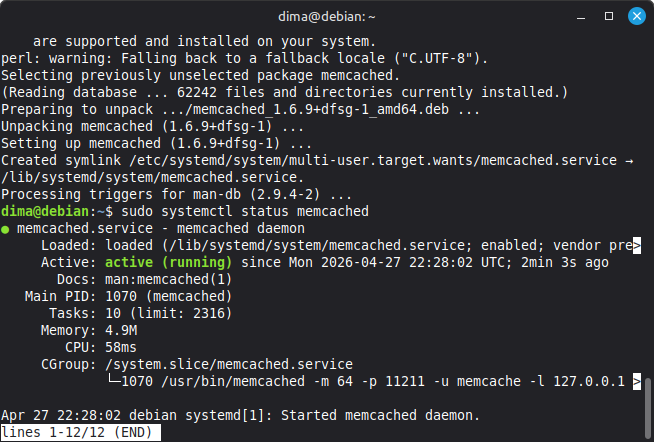
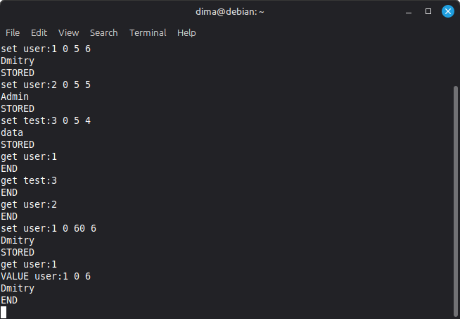
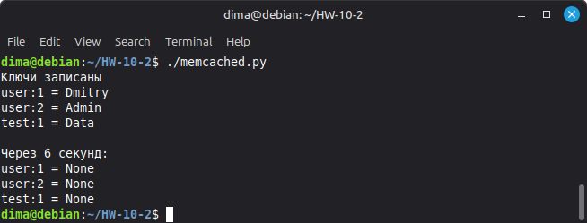
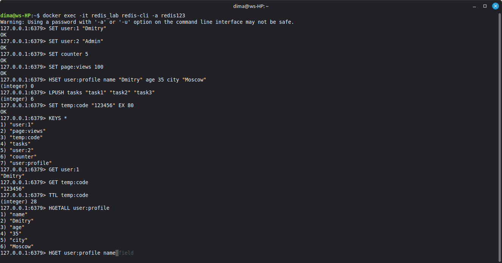
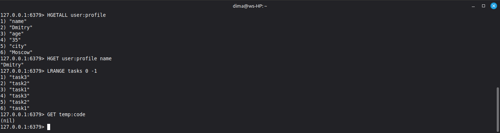
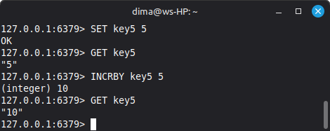

  👨‍🎓 📖 🏫
# Домашнее задание к занятию  «Базы данных их типы» 

Студент: **Герасин Дмитрий Сергеевич**
Модуль: Redis/memcached

HW-10-02

---

### В рамках подготовки к выполнению домашней работы, было подготовлено


### 📁 Структура выполненого задания
.
├── bloknot.txt   мои заметки , подсказки и размышления
├── DB-docker  dir for DB-full
│   ├── docker-compose.yml   используем докер для запуска всех баз 🐳
│   ├── init-mongo
│   └── init-sql
├── DB-lab Пример приложения для тренировок по работе с базами, отладки архитектурных решений
│   ├── app.py
│   ├── Dockerfile
│   └── requirements.txt
├── img  скриншоты, диаграммы
│   ├── 1.1.png
│   ├── 3.1.png
│   ├── 3.2.png
│   ├── 4.1.png
│   ├── 4.2.png
│   └── 5.1.png
├── README.md  собственнно для проверки преподователем
└── scripts  скрипты
    ├── memcached.py  успеть записать и прочесть ключи за 5 сек
    ├── start-all-dbs.sh
    └── stop-all-dbs.sh

7 directories, 15 files
### ⚙️ Требования к системе

```bash
┌──────────────────────────────────────────────┐
│ • Linux Mint / Ubuntu (22.04+)               │
│ • Docker version:     (29.4.0)               | 
│ • Python 3.12.3                              │
│ • 4+ ГБ свободной ОЗУ(2ГБ для docker+запас)  │
└──────────────────────────────────────────────┘
```

### Задание 1. Кеширование

Приведите примеры проблем, которые может решить кеширование.

###  Решение

Кеширование это операция которая уменьшает нагрузку засчет сохранение результата сложной/медленной операции в быстром хранилище, чтобы не повторять её снова.

Кратко о кештровании с аналогией: 

Простыми словами
Memcached — это "почтовый ящик" в оперативной памяти.

В него можно быстро положить что-то (ключ → значение)

И быстро достать по ключу

Данные живут, пока не истечёт время или пока не переполнится память

Проблемы которые помогает решить кеширование и его основное применение, это использование кеширования для ускорения работы серверов.

Проблемы которые помогает решить кеширование:
  
  1. Медленная работа приложения
  2. Перегрузка базы данных
  3. Повторяющиеся вычисления
  4. Задержка из за сети
  5. Снижение нагрузки на внешие API
   

Проблема: Пользователь открывает сайт, а он грузится 10 секунд. Почему? Потому что каждый раз сервер обращается к базе данных, которая находится на другом конце страны или даже мира.

Что делает кеширование: После первого запроса сервер сохраняет важную информацию в кеш (например, в оперативную память). Следующие 1000 пользователей получат ответ за 0.1 секунду из кеша. 

Проблема: База данных — самое слабое место в системе. Она медленная, если к ней обращаться слишком часто.

Пример: Представьте что у вас есть огромная библиотека (база данных). Чтобы найти книгу, библиотекарь идёт в хранилище, ищет по картотеке, потом идёт на стеллаж. Это занимает 1 минуту. Если 100 человек одновременно спрашивают одну и ту же книгу — библиотекарь должен 100 раз пробежать туда-сюда.

Что делает кеширование: Библиотекарь выкладывает самые популярные книги на отдельный стол рядом с входом. Теперь 99 человек берут книгу со стола за 5 секунд, и только 1 человек идёт в хранилище.

Проблема: Есть операции, которые требуют много времени или ресурсов процессора.

Пример: На сайте есть калькулятор кредита. Человек вводит сумму, процент, срок — сервер считает по сложной формуле с плавающей точкой, это занимает 0.5 секунды процессорного времени. Если 100 человек считают одновременно — процессор загружается на 100%, сайт тормозит.

Что делает кеширование: Сервер запоминает результат расчёта для каждой комбинации параметров. Если второй человек введёт те же цифры — ответ придёт мгновенно.

Проблема: Сервер в Москве, а база данных — во Владивостоке. Сигнал идёт туда-обратно 0.2 секунды. Если 10 запросов подряд — уже 2 секунды только на дорогу.

Пример: Ты работаешь в офисе в Москве, но файлы лежат на сервере в Новосибирске. Чтобы открыть документ, нужно:

Запросить список файлов
Открыть файл
Сохранить изменения
Каждый шаг — 0.2 секунды задержки. Работать некомфортно.

Что делает кеширование: Поставить промежуточный сервер в Москве (CDN), который копирует самые нужные файлы и отдаёт их локально. Задержка становится 0.005 секунды.

Проблема: Внешние сервисы (API) часто имеют ограничения по количеству запросов и платные.

Пример: Твой сайт показывает погоду. Погодный API разрешает 1000 запросов в день бесплатно, а потом берёт деньги. Если у тебя 2000 посетителей в день — каждый второй запрос платный.

Что делает кеширование: Ты сохраняешь погоду в свой кеш на 1 час. Погода не меняется каждую минуту. Вместо 2000 запросов к API ты делаешь 24 запроса в сутки (раз в час). Экономия огромная.


### Задание 2. Memcached

Установите и запустите memcached.

Приведите скриншот systemctl status memcached, где будет видно, что memcached запущен.

### Решение

Установим пакет:

```
 sudo apt install memcached -y

``` 

Проверим сервис:

```
 sudo systemctl status memcached

```
скриншот статуса 




### Задание 3. Удаление по TTL в Memcached
Запишите в memcached несколько ключей с любыми именами и значениями, для которых выставлен TTL 5

Приведите скриншот, на котором видно, что спустя 5 секунд ключи удалились из базы.

### Решение

для подключение к базе данных установим telnet

```
sudo apt install telnet -y

```
подключаемся к базе используя telnet

```bash
telnet localhost 11211
# записываем ключи с TTL 5 сек
set user:1 0 5 6
Dmitry
# проверяем что ключи есть
get user:1

```
начал вводить команды на запись ключей руками
но при выполнении проверки сужествования понимал что их уже нет 
так как установили время жизни 5 сек, 
соответственно увеличил TPL до 60 сек.



для выполнения работы что бы быстро ввести минимальное количество ключей 
у которых время жизни 5 сек успеть проверить что они есть
сделать скриншот живых существующих ключей, будем использовать скрипт

```python
python3 -c "
import memcache
mc = memcache.Client(['127.0.0.1:11211'])
mc.set('user:1', 'Dmitry', time=5)
mc.set('user:2', 'Admin', time=5)
mc.set('test:1', 'Data', time=5)
print('Ключи записаны')
print('user:1 =', mc.get('user:1'))
print('user:2 =', mc.get('user:2'))
print('test:1 =', mc.get('test:1'))
import time
time.sleep(6)
print('\\nЧерез 6 секунд:')
print('user:1 =', mc.get('user:1'))
print('user:2 =', mc.get('user:2'))
print('test:1 =', mc.get('test:1'))
"
```
результат работы скрипта,  скриншот:




### Задание 4. Запись данных в Redis

Запишите в Redis несколько ключей с любыми именами и значениями.

Через redis-cli достаньте все записанные ключи и значения из базы, приведите скриншот этой операции.

### Решение

 📦   Для выполнения задания запустим контейнера с базами, и подключимся к redis ⚡ 🔴

  - [docker DB](DB-docker/docker-compose.yml)

```bash
docker-compose up -d

docker exec -it redis redis-cli

```

 скриншот выполнения





### Задание 5*. Работа с числами

Запишите в Redis ключ key5 со значением типа "int" равным числу 5. Увеличьте его на 5, чтобы в итоге в значении лежало число 10.

Приведите скриншот, где будут проделаны все операции и будет видно, что значение key5 стало равно 10.





✅
---
---
---

🧰 Полезные команды

Для работы с докер 

```bash
docker-compose -f docker-compose-cache.yml up -d

# Остановка
docker-compose -f docker-compose-cache.yml down

# Просмотр логов
docker logs redis
docker logs memcached

# Подключение к контейнеру
docker exec -it redis sh
docker exec -it redis redis-cli
```
работа с memcached 

```bash
# Запись
set key flags ttl length
value
# Чтение
get key
# Удаление
delete key
# Очистка всего
flush_all
# Статистика
stats
```
работа с redis:7

```bash
# Строки
SET key value
GET key
DEL key
EXISTS key
# Числа
SET counter 5
INCR counter
INCRBY counter 5
DECR counter
# Время жизни
SET key value EX 60
EXPIRE key 60
TTL key
# Hash
HSET user:1 name "Dima"
HGET user:1 name
HGETALL user:1
# Списки
LPUSH list item
RPUSH list item
LRANGE list 0 -1
# Управление
KEYS *
FLUSHALL  # ОЧЕНЬ ОСТОРОЖНО! Удаляет всё
INFO
```

